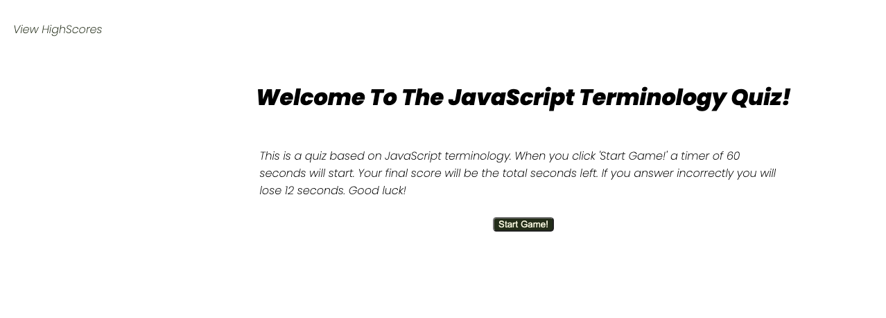

# Quiz Built Using Javascript

I built this page in response to our fourth homework challenge. We were tasked with building a quiz using html, CSS, and JavaScript. Although it contains all three languages, the primary volume of code is in JavaScript as it is adding all of the dynamic user inputs that the page centers around. The webpage can be reached [here](https://ajaws2022.github.io/Full-Stack-Quiz/). And an example image can be seen below: 

